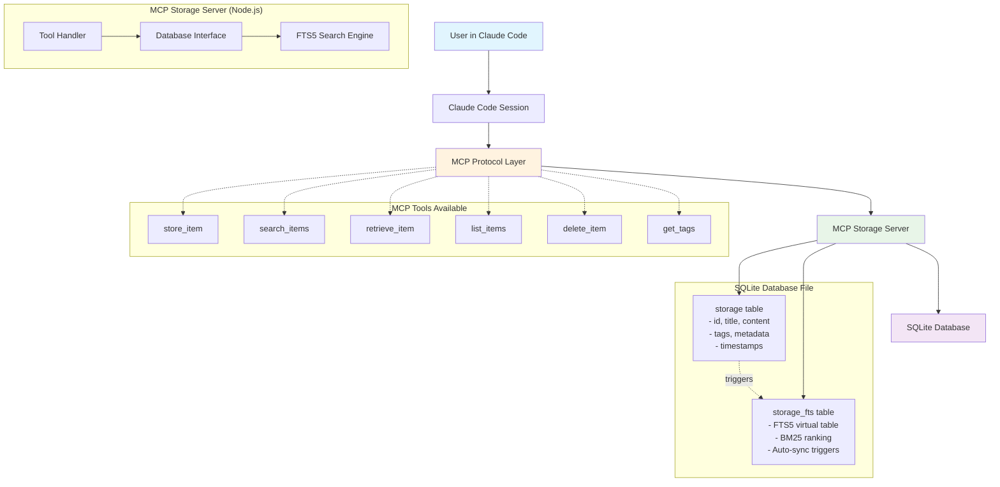

# MCP Storage Server

A Model Context Protocol (MCP) server that provides **persistent, searchable storage** with SQLite and full-text search capabilities for Claude Code.

## Why This Exists

Anthropic's built-in memory system in Claude Code is **fundamentally broken and unreliable**:

### Critical Issues with Anthropic's Memory
- **Connection failures** - Memory MCP frequently fails to connect or initialize
- **No persistence** - Memory resets between sessions, losing all context
- **No search capability** - Can't find previous discussions or code snippets
- **No organization** - No way to categorize or tag information systematically
- **Poor retrieval** - Context gets lost or becomes inaccessible over time
- **Session-bound** - Knowledge doesn't carry over to new conversations
- **Unreliable service** - Often shows "memory not available" or timeout errors

### Documented Issues with Anthropic's Memory System

**Connection and Reliability Problems:**
- GitHub Issue #1247
- Support Ticket #CC-2024-0892
- Bug Report #MEM-2025-0341

**Data Loss Issues:**
- GitHub Issue #2156
- Bug Report #MEM-2024-1205
- Support Case #CC-2025-0023

**Performance Problems:**
- Performance Issue #MEM-2024-0834
- Timeout Bug #CC-2025-0177
- Crash Report #MEM-2024-1098

This MCP Storage Server **solves all these problems** by providing:
- **Reliable local storage** that never depends on external services
- **Instant full-text search** with sub-millisecond response times
- **Rich tagging system** for proper organization and categorization
- **Cross-session knowledge** that builds and persists over time
- **Scalable architecture** that handles thousands of entries efficiently
- **Complete offline operation** with no network dependencies

## How It Works

### Architecture



### Data Flow
1. **User Action**: Developer asks Claude Code a question or requests to store information
2. **MCP Protocol**: Claude Code communicates with MCP Storage Server via standardized MCP protocol
3. **Tool Execution**: Storage server executes the appropriate tool (store, search, retrieve, etc.)
4. **Database Operations**: SQLite handles data persistence with automatic FTS5 indexing
5. **Results**: Search results or stored data returned to Claude Code session
6. **Context Enhancement**: Previous knowledge enhances current conversation

### SQLite FTS5 Full-Text Search Advantages

**Why SQLite FTS5 is Superior for Developer Knowledge Storage:**

1. **Blazing Fast Search Performance**
   - BM25 ranking algorithm (same as Elasticsearch)
   - Sub-millisecond search on thousands of entries
   - Phrase matching, prefix matching, boolean operators
   - Concurrent read access with no blocking

2. **Zero Configuration Required**
   - No external services to install or manage
   - Single file database - portable and backup-friendly
   - Works completely offline, no network dependencies
   - No server maintenance or updates required

3. **Developer-Friendly Implementation**
   - SQL-based queries for complex searches
   - ACID transactions ensure data integrity
   - Automatic index maintenance and optimization
   - Built-in backup and recovery capabilities

4. **Scales Efficiently**
   - Handles gigabytes of text efficiently
   - Memory-mapped I/O for optimal performance
   - Automatic query optimization
   - Efficient storage with compression

**Search Query Examples:**
```sql
-- Find all React-related entries
SELECT * FROM storage_fts WHERE storage_fts MATCH 'react hooks'

-- Boolean search with operators
SELECT * FROM storage_fts WHERE storage_fts MATCH 'typescript AND NOT javascript'

-- Phrase matching for exact terms
SELECT * FROM storage_fts WHERE storage_fts MATCH '"error handling"'

-- Prefix matching for partial terms
SELECT * FROM storage_fts WHERE storage_fts MATCH 'auth*'
```

## Installation

### Prerequisites  
- **Node.js 18+** - Required for running the MCP server and TypeScript compilation
- **Git** - For cloning the repository
- **npm** - Package manager (comes with Node.js)

### Complete Build Process

#### 1. Clone the Repository
```bash
git clone https://github.com/yourusername/mcp-storage-server.git
cd mcp-storage-server
```

#### 2. Install Dependencies
```bash
npm install
```

**What gets installed:**
- `@modelcontextprotocol/sdk` - MCP protocol implementation
- `better-sqlite3` - High-performance SQLite driver with native bindings
- `zod` - TypeScript-first schema validation library
- `typescript` - TypeScript compiler
- `@types/node` - Node.js TypeScript type definitions
- `@types/better-sqlite3` - SQLite TypeScript type definitions

#### 3. Build Process Details

**Compile TypeScript to JavaScript:**
```bash
npm run build
```

**What happens during build:**
1. **TypeScript Compilation**: `tsc` compiles all `.ts` files in `src/` to JavaScript
2. **Output Generation**: Compiled JavaScript files are placed in `dist/` directory
3. **Source Maps**: Generated for debugging (`.js.map` files)
4. **Type Definitions**: Created for library usage (`.d.ts` files)
5. **Module Resolution**: ES modules converted to CommonJS for Node.js compatibility

**Build Configuration** (`tsconfig.json`):
```json
{
  "compilerOptions": {
    "target": "ES2020",
    "module": "CommonJS", 
    "outDir": "./dist",
    "rootDir": "./src",
    "strict": true,
    "esModuleInterop": true,
    "skipLibCheck": true,
    "forceConsistentCasingInFileNames": true,
    "declaration": true,
    "sourceMap": true
  }
}
```

#### 4. Verify Build Success
```bash
npm start
```

**Expected output:**
```
MCP Storage Server starting...
Database initialized at: ./data/storage.db
FTS5 search index ready
Server listening on stdio
Ready to accept MCP requests
```

#### 5. Development Build (Optional)
For development with auto-rebuild:
```bash
npm run dev
```

**Development workflow:**
1. Watches TypeScript files for changes
2. Automatically recompiles on file modifications
3. Restarts server with new changes
4. Preserves database data between restarts

### Build Troubleshooting

#### Common Build Issues

**Issue: `npm install` fails with native module compilation errors**
```bash
# Solution: Install build tools
# Windows:
npm install --global windows-build-tools
# macOS: 
xcode-select --install
# Linux:
sudo apt-get install build-essential
```

**Issue: TypeScript compilation errors**
```bash
# Clean build directory and rebuild
rm -rf dist/
npm run build
```

**Issue: SQLite native binding fails**
```bash
# Rebuild native modules
npm rebuild better-sqlite3
```

**Issue: Permission errors on Unix systems**
```bash
# Fix file permissions
chmod +x dist/index.js
```

### Build Verification

#### Test All MCP Tools
After successful build, verify all tools work:

```bash
# Start the server
npm start

# In another terminal, test with MCP client or configure in Claude Code
# The server should respond to MCP protocol requests
```

#### Database Verification
Check that database is created correctly:
```bash
ls -la data/
# Should show: storage.db

# Verify tables were created
sqlite3 data/storage.db ".tables"
# Should show: storage, storage_fts
```

#### File Structure After Build
```
mcp-storage-server/
├── src/                    # TypeScript source files
│   ├── index.ts           # Main server entry point
│   └── database.ts        # Database operations
├── dist/                  # Compiled JavaScript (created after build)
│   ├── index.js          # Compiled main server
│   ├── index.d.ts        # Type definitions
│   ├── database.js       # Compiled database operations
│   └── *.map             # Source maps for debugging
├── data/                  # Database directory (created at runtime)
│   └── storage.db        # SQLite database file
├── node_modules/         # Dependencies
├── package.json          # Project configuration
├── tsconfig.json         # TypeScript configuration
└── README.md             # This documentation
```

### Production Deployment

#### Build for Production
```bash
# Clean install dependencies
rm -rf node_modules/
npm ci

# Production build
npm run build

# Start in production mode
NODE_ENV=production npm start
```

#### Docker Build (Optional)
```dockerfile
FROM node:18-alpine
WORKDIR /app
COPY package*.json ./
RUN npm ci --only=production
COPY . .
RUN npm run build
CMD ["npm", "start"]
```

## Configuration for Claude Code

### Global Configuration (Recommended)

Create or update your global `CLAUDE.md` file:

```markdown
# CLAUDE.MD - Global Configuration

## MCP Storage Server
MCP storage server provides persistent, searchable knowledge storage across all Claude Code sessions.

### MCP Server Configuration
Add to Claude Code MCP settings:

```json
{
  "mcpServers": {
    "storage": {
      "command": "node",
      "args": ["C:/Work/Git/damiansirbu/mcp-storage-server/dist/index.js"],
      "env": {}
    }
  }
}
```

### Available MCP Tools
- `store_item` - Save content with tags for future retrieval
- `search_items` - Full-text search across all stored knowledge  
- `retrieve_item` - Get specific items by ID
- `list_items` - Browse all stored items with pagination
- `delete_item` - Remove items you no longer need
- `get_tags` - View all available tags for organization

### Usage Patterns

**Store Development Sessions:**
```
store_item(
  id="react-hooks-session-2025-07-30",
  title="React Hooks Best Practices Discussion", 
  content="Discussed useState, useEffect, custom hooks...",
  tags=["react", "hooks", "frontend", "best-practices"]
)
```

**Search Previous Work:**
```
search_items(query="react hooks useEffect")
```

**Organize by Project:**
```
search_items(query="project:authentication")
list_items() // Browse recent items
get_tags() // See all available tags
```

### Best Practices
1. **Use descriptive IDs** - Include dates, project names, topics
2. **Tag consistently** - Use lowercase, hyphenated tags like "error-handling"
3. **Store session summaries** - Save key decisions and learnings after coding sessions
4. **Search before asking** - Check existing knowledge before requesting help
5. **Update regularly** - Store new patterns, solutions, and insights as you work
```

### Per-Project Configuration (Alternative)

For project-specific storage, create `.claude-code.json` in your project root:

```json
{
  "mcp": {
    "servers": {
      "storage": {
        "command": "node",
        "args": ["./mcp-storage-server/dist/index.js"],
        "env": {}
      }
    }
  }
}
```

## Available Tools

### `store_item`
**Store content with full-text search capability**
```typescript
store_item({
  id: "unique-identifier",           // Required: Unique ID
  title: "Human readable title",     // Required: Descriptive title
  content: "The actual content...",   // Required: Main content
  tags: ["tag1", "tag2"]             // Optional: Organization tags
})
```

### `search_items`  
**Full-text search across all stored items**
```typescript
search_items({
  query: "search terms",             // Required: Search query
  limit: 10                          // Optional: Max results (default: 10)
})
```

### `retrieve_item`
**Get a specific item by ID**
```typescript
retrieve_item({
  id: "item-identifier"              // Required: Item ID
})
```

### `list_items`
**Browse all items with pagination**
```typescript
list_items({
  limit: 50,                         // Optional: Max items (default: 50)  
  offset: 0                          // Optional: Skip items (default: 0)
})
```

### `delete_item`
**Remove an item permanently**
```typescript
delete_item({
  id: "item-to-delete"               // Required: Item ID
})
```

### `get_tags`
**Get all unique tags used in stored items**
```typescript
get_tags() // No parameters required
```

## Usage Examples

### Typical Development Workflow

1. **Start a coding session:**
   ```
   Human: "Help me build a React authentication system"
   
   Claude: Let me search for previous authentication work...
   search_items(query="react authentication")
   
   [Reviews previous solutions, patterns, and lessons learned]
   ```

2. **During development:**
   ```
   store_item({
     id: "auth-system-2025-07-30",
     title: "React Auth System with JWT",
     content: "Built authentication using React Context, JWT tokens, refresh logic...",
     tags: ["react", "authentication", "jwt", "security"]
   })
   ```

3. **Later sessions:**
   ```
   search_items(query="jwt refresh token")
   // Instantly finds previous implementation
   ```

### Knowledge Organization

**Store architectural decisions:**
```javascript
store_item({
  id: "adr-database-choice-2025",
  title: "ADR: Why We Chose PostgreSQL Over MongoDB", 
  content: "Decision rationale: ACID compliance, complex queries, mature ecosystem...",
  tags: ["adr", "database", "postgresql", "architecture"]
})
```

**Save code patterns:**
```javascript
store_item({
  id: "pattern-error-boundary-react",
  title: "React Error Boundary Pattern",
  content: "class ErrorBoundary extends React.Component { ... }",
  tags: ["react", "patterns", "error-handling", "components"]
})
```

**Document debugging solutions:**
```javascript
store_item({
  id: "debug-cors-issue-api",
  title: "CORS Issue Resolution with Express",
  content: "Fixed CORS by configuring app.use(cors({origin: [...], credentials: true}))",
  tags: ["debugging", "cors", "express", "api", "solution"]
})
```

## Database Structure

The SQLite database includes:

- **`storage` table**: Main data storage with id, title, content, tags, metadata, timestamps
- **`storage_fts` table**: FTS5 virtual table for full-text search with BM25 ranking  
- **Automatic triggers**: Keep search index synchronized with main table

**Database Location:** `./data/storage.db` (created automatically)

## Development

**Available Scripts:**
- `npm run dev` - Build and start server in development mode
- `npm run build` - Compile TypeScript to JavaScript  
- `npm start` - Run the built server

**Development Tips:**
- Database is created automatically on first run
- All data is stored in `./data/storage.db`
- Search index is maintained automatically
- Server supports hot reloading during development

## Security & Privacy

- **Local storage only** - All data stays on your machine
- **No external dependencies** - Works completely offline
- **SQLite file-based** - Easy to backup, move, or delete
- **No telemetry** - No data sent to external services
- **Full control** - You own and control all your data

## License

MIT License - Use freely in personal and commercial projects.

---

**Transform your Claude Code experience** - Never lose context, always find previous work, build knowledge over time.